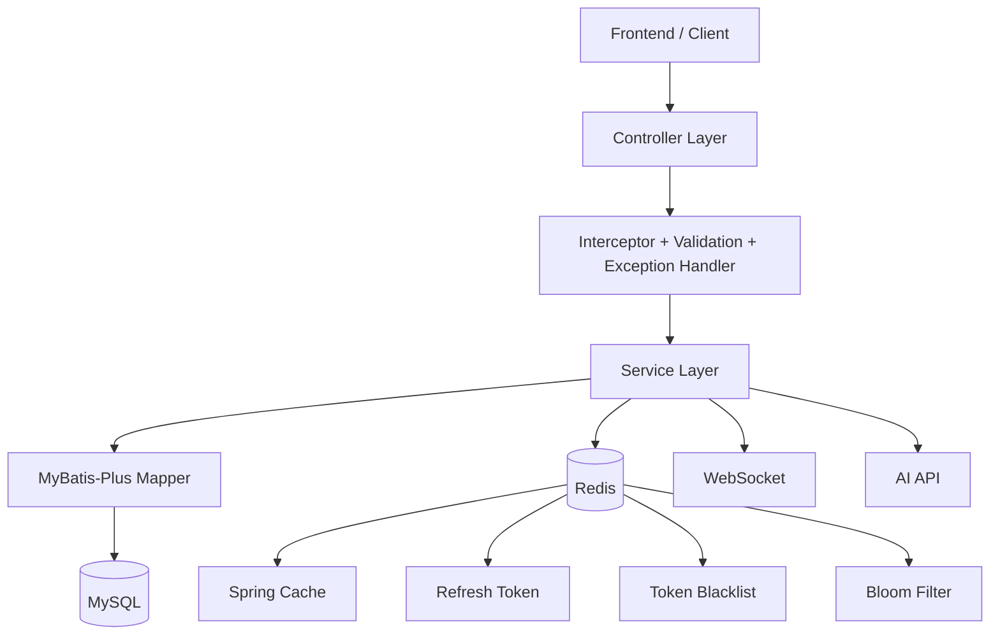
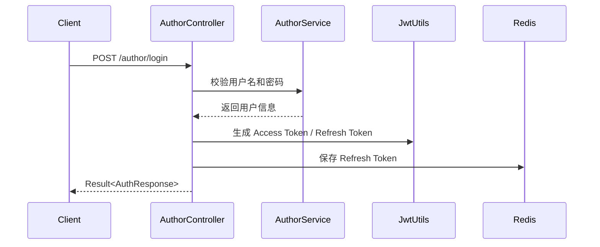
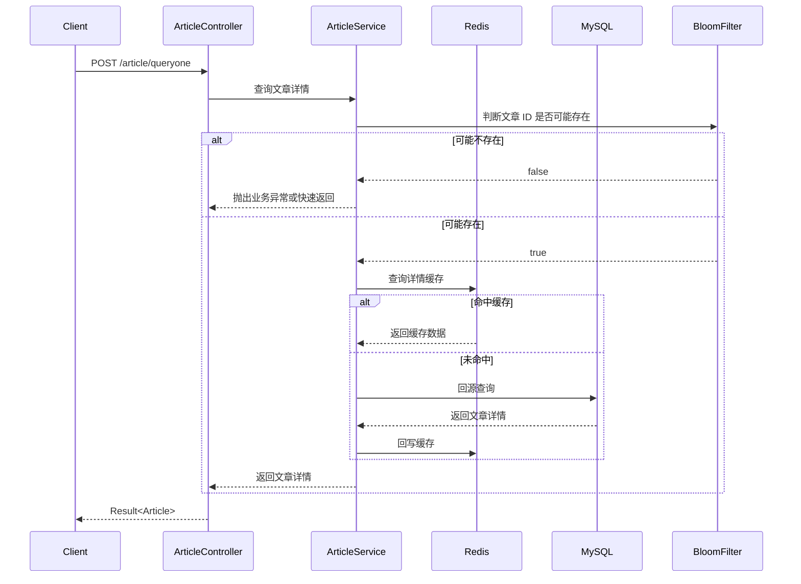

# Demo Blog Backend

[](./pom.xml)
[](./pom.xml)
[](./pom.xml)
[](./blog_system.sql)
[](./demo-server/src/main/resources/application.properties)

> 一个基于 Spring Boot 的多模块博客后端项目，围绕文章发布、社交互动与后台管理构建，集成 JWT 双令牌鉴权、Redis 缓存优化、WebSocket 实时通知和 AI 辅助写作等核心能力。

## 目录

- [项目简介](#项目简介)
- [项目亮点](#项目亮点)
- [业务能力总览](#业务能力总览)
- [技术栈](#技术栈)
- [整体架构](#整体架构)
- [请求流程图](#请求流程图)
- [架构与模块划分](#架构与模块划分)
- [核心设计说明](#核心设计说明)
- [Quick Start](#quick-start)
- [接口模块概览](#接口模块概览)
- [请求与响应示例](#请求与响应示例)
- [配置说明](#配置说明)
- [数据库核心表](#数据库核心表)
- [核心特性](#核心特性)
- [部署说明](#部署说明)
- [开发说明](#开发说明)
- [补充说明](#补充说明)

## 项目简介

这是一个面向博客平台场景的后端服务端工程，采用 Maven 多模块组织方式，将公共能力、领域实体与业务服务拆分管理，覆盖用户、文章、分类、评论、点赞、收藏、关注、后台管理与 AI 文本辅助等典型博客业务。项目不仅具备完整的 CRUD 能力，还实现了 JWT 双令牌认证、Redis 缓存体系、布隆过滤器防穿透、AOP 日志审计、WebSocket 实时通知以及基于 SSE 的 AI 流式输出，兼顾功能完整性与工程化实践。

从代码结构上看，这个项目更像一套“带工程治理能力的博客后端模板”。它不是单纯的接口集合，而是把统一返回结构、异常码体系、缓存策略、权限拦截链、异步聚合查询、实时消息与第三方 AI 服务调用都沉淀到了后端架构中，适合作为课程设计、毕业设计、全栈练手项目或中小型内容平台后端原型的基础工程。

## 项目亮点

| 维度 | 内容 |
| --- | --- |
| 架构组织 | 使用 `demo-common`、`demo-pojo`、`demo-server` 三个 Maven 模块分离公共能力、实体定义与业务服务 |
| 安全设计 | 基于 Access Token + Refresh Token 的双令牌体系，结合 Redis 黑名单与拦截器完成接口鉴权 |
| 性能优化 | 通过 Spring Cache、Redis、分布式互斥锁、随机过期时间、布隆过滤器降低缓存击穿、雪崩、穿透风险 |
| 交互体验 | 支持 WebSocket 实时通知与 AI 文本润色、续写、摘要流式输出 |
| 可维护性 | 提供统一返回结构、统一异常处理、AOP 操作日志、分组校验、分页配置等基础治理能力 |

## 业务能力总览

| 模块 | 主要职责 | 代表接口 |
| --- | --- | --- |
| 用户模块 | 注册、登录、退出、资料查询、资料更新、用户全量信息聚合 | `/author/login`、`/author/register`、`/author/update`、`/author/allmessage` |
| 管理模块 | 管理员登录、用户管理、分类管理、文章审核与状态切换 | `/admin/login`、`/admin/list`、`/admin/categories/*`、`/admin/articles/*` |
| 文章模块 | 文章新增、删除、查询、修改、草稿、发布、下线状态流转 | `/article/insert`、`/article/query`、`/article/public` |
| 分类模块 | 分类新增、删除、查询、更新 | `/category/insert`、`/category/query`、`/category/update` |
| 评论模块 | 发表评论、查询文章评论列表 | `/comment/setComment`、`/comment/getCommentList` |
| 点赞模块 | 点赞、取消点赞、查询文章点赞用户、查询当前用户点赞列表 | `/thumbs_up/thumbs`、`/thumbs_up/thumbs_author_list` |
| 收藏模块 | 收藏、取消收藏、查询当前用户收藏列表 | `/favorite/favorites`、`/favorite/author_favorites_list` |
| 关注模块 | 关注、取关、关注列表、粉丝列表、关注流文章查询 | `/follows/follow`、`/follows/unfollow`、`/follows/foll` |
| 数据看板 | 全局数量统计、分类文章统计 | `/dashboard/alltotal`、`/dashboard/category_article_total` |
| 令牌模块 | 刷新 Access Token | `/jwt/accesstoken` |
| AI 模块 | AI 润色、续写、摘要、健康检查 | `/api/ai/generate`、`/api/ai/health` |

## 技术栈

| 分类 | 技术选型 | 说明 |
| --- | --- | --- |
| 核心框架 | Spring Boot 2.6.13、Spring MVC、Spring AOP | 后端基础框架、接口开发与切面能力 |
| 数据访问 | MyBatis-Plus 3.5.3.1、MySQL 8 | 分页查询、条件构造、关系型数据存储 |
| 缓存与中间件 | Redis、Spring Cache、WebSocket、RabbitMQ | 缓存、实时消息、消息基础设施预留 |
| 安全认证 | JWT、Spring Security、Spring MVC Interceptor、BCrypt | 当前权限校验主要由 JWT + 拦截器完成，密码使用 BCrypt 加密 |
| AI 能力 | OkHttp、SSE、OpenAI Compatible API | 支持 AI 润色、续写、摘要的流式输出 |
| 开发辅助 | Lombok、Fastjson、JSR-303 Validation | 简化实体代码、JSON 处理、参数校验 |
| 构建方式 | Maven Multi-Module | `demo-common`、`demo-pojo`、`demo-server` 分模块构建 |

## 整体架构



## 请求流程图

### 登录鉴权时序



### 文章查询缓存路径



## 架构与模块划分

```text
BoKeXT/
├─ pom.xml                                     # 根 Maven 聚合工程，统一依赖版本与模块管理
├─ blog_system.sql                             # MySQL 初始化脚本
├─ demo-common/                                # 公共模块：统一响应、异常、上下文、常量、枚举
│  └─ src/main/java/com/example/demo/common/
│     ├─ Result.java                           # 统一 API 返回结构
│     ├─ BusinessException.java                # 业务异常封装
│     ├─ ErrorCode.java                        # 错误码定义
│     ├─ UserContext.java                      # 当前登录用户上下文
│     ├─ constants/                            # 缓存 Key、敏感词等常量
│     └─ enums/                                # 文章状态、交互状态、操作状态等枚举
├─ demo-pojo/                                  # 领域实体模块：Entity / DTO / 认证响应对象
│  └─ src/main/java/com/example/demo/pojo/entity/
│     ├─ Article.java                          # 文章实体
│     ├─ Author.java                           # 用户实体
│     ├─ Category.java                         # 分类实体
│     ├─ Comment.java                          # 评论实体
│     ├─ Favorites.java                        # 收藏实体
│     ├─ Follows.java                          # 关注实体
│     ├─ Thumbs_up.java                        # 点赞实体
│     ├─ Dashboard.java                        # 数据看板对象
│     ├─ AuthResponse.java                     # 登录/刷新令牌响应对象
│     └─ ValidationGroups.java                 # 分组校验定义
└─ demo-server/                                # 服务模块：控制层、业务层、配置层、持久层
   ├─ src/main/java/com/example/demo/
   │  ├─ DemoApplication.java                  # Spring Boot 启动入口
   │  ├─ annotation/                           # 自定义注解，如 @SystemLog
   │  ├─ aspect/                               # AOP 切面，如系统操作日志记录
   │  ├─ config/                               # Redis、CORS、分页、AI、WebSocket 等配置
   │  ├─ controller/                           # 对外 REST 接口层
   │  │  ├─ AuthorController.java              # 用户注册、登录、资料查询
   │  │  ├─ AdminController.java               # 管理端用户、分类、文章管理
   │  │  ├─ ArticleController.java             # 文章 CRUD 与状态流转
   │  │  ├─ CategoryController.java            # 分类管理
   │  │  ├─ CommentController.java             # 评论能力
   │  │  ├─ FavoritesController.java           # 收藏能力
   │  │  ├─ FollowsController.java             # 关注、粉丝能力
   │  │  ├─ ThumbsUpController.java            # 点赞能力
   │  │  ├─ DashboardController.java           # 数据看板统计
   │  │  ├─ accessTokenController.java         # Access Token 刷新接口
   │  │  └─ AIController.java                  # AI 生成与流式输出接口
   │  ├─ handler/                              # 全局异常处理
   │  ├─ interceptor/                          # Admin、Author、Article、Category 鉴权拦截链
   │  ├─ mapper/                               # MyBatis-Plus Mapper 与 XML
   │  ├─ service/                              # 业务接口与实现
   │  │  └─ impl/
   │  │     ├─ ArticleService.java             # 文章核心业务、缓存、布隆过滤器、通知
   │  │     ├─ AuthorService.java              # 用户注册登录、缓存、异步聚合查询
   │  │     ├─ RefreshTokenService.java        # Refresh Token 存储与校验
   │  │     ├─ TokenBlacklistService.java      # Access Token 黑名单
   │  │     ├─ DashboardService.java           # 后台统计服务
   │  │     └─ AIServiceImpl.java              # AI 服务调用实现
   │  ├─ utils/                                # JWT、缓存互斥锁、布隆过滤器工具
   │  └─ websocket/                            # WebSocket 会话与消息推送处理
   └─ src/main/resources/
      ├─ application.properties                # 项目主配置文件
      ├─ 2026-03-21-fix-schema.sql             # 数据库结构修复脚本
      └─ static/index.html                     # 静态资源入口
```

## 核心设计说明

### 认证与权限模型

项目采用 JWT 双令牌设计：

- `Access Token` 用于访问受保护接口。
- `Refresh Token` 用于换取新的 `Access Token`。
- `RefreshTokenService` 将 Refresh Token 存储在 Redis 中，并以用户维度做校验。
- 用户退出登录时，`TokenBlacklistService` 会把当前 Access Token 放入 Redis 黑名单，直到令牌自然过期。
- 实际接口权限控制主要由 `WebMvcConfig` 注册的拦截器链完成，而非完全依赖 Spring Security 默认机制。

当前拦截链的职责如下：

| 拦截器 | 作用范围 | 职责 |
| --- | --- | --- |
| `AdminInterceptor` | `/admin/**` | 校验管理员身份与 JWT 合法性 |
| `AuthorInterceptor` | `/author/**` 的受保护接口 | 校验普通用户登录态 |
| `ArticleInterceptor` | `/article/**` 的受保护接口 | 约束文章相关受保护操作 |
| `CategoryInterceptor` | `/category/**` 的受保护接口 | 约束分类相关受保护操作 |
| `Interceptor` | `/comment/**`、`/follows/**`、`/favorite/**`、`/thumbs_up/**` | 统一处理用户侧交互接口的 Token 校验 |

### 缓存设计

项目缓存策略集中定义在 `CacheConfig` 中，使用 Redis 作为底层存储。不同业务设置了不同 TTL，尽量兼顾命中率与数据新鲜度。

| 缓存名称 | 典型内容 | 默认策略 |
| --- | --- | --- |
| `Author` | 单个用户信息 | 30 分钟 |
| `Author:Search:List` | 用户搜索列表 | 10 分钟 |
| `Author:All:Message` | 用户聚合信息 | 15 分钟 |
| `Article:detail` | 文章详情 | 10 分钟 |
| `category` | 分类数据 | 1 小时 |
| `category_on_article_total` | 分类文章统计 | 30 分钟 |
| `comment` | 评论列表 | 3 分钟 |
| `Dashboard:Count` | 后台统计汇总 | 15 分钟 |
| `author:favorites:article:list` | 用户收藏列表 | 5 分钟 |
| `author:follow` | 关注、粉丝列表 | 5 分钟 |
| `thumbsup:article:author:list` | 文章点赞用户列表 | 5 分钟 |
| `author:thumbsup:list` | 用户点赞列表 | 5 分钟 |

此外，项目还补充了三种针对高并发场景的保护策略：

1. `CacheMutexUtil` 基于 Redis 分布式互斥锁，缓解热点 Key 失效时的大量并发回源问题。
2. `BloomFilterUtil` 基于 Redis 位图构建布隆过滤器，用于提前拦截明显不存在的文章 ID。
3. `ArticleService` 在文章列表缓存中引入随机过期与缓存版本号，降低大面积同时过期带来的雪崩风险。

### 实时通知设计

- `WebSocketHandler` 通过 `/ws/{authorId}` 建立长连接。
- 当作者发布新文章时，`ArticleService` 会查询其粉丝列表，并向目标用户推送通知消息。
- WebSocket 处理器还实现了在线人数统计、会话活跃时间维护与超时会话清理，避免长连接资源长期占用。

### AI 流式输出设计

- `AIController` 提供 `/api/ai/generate` 接口，支持 `polish`、`continue`、`summarize` 三类操作。
- `AIServiceImpl` 使用 OkHttp 调用兼容 OpenAI Chat Completions 协议的上游模型接口。
- 返回结果通过 `SseEmitter` 逐片下发到客户端，适合前端实现实时增量渲染。

### 日志与异常治理

- `@SystemLog` + `SystemLogAspect` 记录模块、业务动作、请求 IP、URL、参数、耗时、异常信息等。
- `GlobalExceptionHandler` 统一捕获业务异常、参数校验异常和系统异常，避免接口层直接暴露堆栈信息。
- `Result` 封装统一返回结构，减少前后端联调中的格式分歧。

## Quick Start

### 1. 环境准备

| 组件 | 版本建议 | 是否必需 | 说明 |
| --- | --- | --- | --- |
| JDK | 17 | 必需 | 根 `pom.xml` 已显式指定 `java.version=17` |
| Maven | 3.8+ | 必需 | 用于多模块编译与启动 |
| MySQL | 8.0+ | 必需 | 主业务数据库，默认库名为 `blog_system` |
| Redis | 6.0+ | 必需 | 用于缓存、Refresh Token、黑名单、布隆过滤器位图等 |
| Node.js | 18+ | 可选 | 仅在需要单独运行 `frontend/` 前端工程时使用，启动后端本身不依赖 |
| RabbitMQ | 3.8+ | 可选 | 当前项目已提供基础交换机、队列配置，但本地启动后端不是强制依赖 |

### 2. 初始化数据库

```bash
mysql -u root -p -e "CREATE DATABASE IF NOT EXISTS blog_system DEFAULT CHARACTER SET utf8mb4 COLLATE utf8mb4_unicode_ci;"
mysql -u root -p blog_system < blog_system.sql
mysql -u root -p blog_system < demo-server/src/main/resources/2026-03-21-fix-schema.sql
```

### 3. 修改本地配置

编辑 `demo-server/src/main/resources/application.properties`，至少确认以下配置项：

```properties
server.port=8080

spring.datasource.url=jdbc:mysql://localhost:3306/blog_system?serverTimezone=Asia/Shanghai&useUnicode=true&characterEncoding=utf-8
spring.datasource.username=你的 MySQL 用户名
spring.datasource.password=你的 MySQL 密码

spring.redis.host=localhost
spring.redis.port=6379

jwt.secret=请替换为你自己的高强度密钥
jwt.access-token-expiration=900000
jwt.refresh-token-expiration=86400000

ai.api.key=你的 AI API Key
ai.api.base-url=你的 OpenAI Compatible Base URL
ai.api.model=可用模型名
```

> 建议将数据库密码、JWT 密钥、AI Key 等敏感配置改为环境变量或外部配置中心管理，不要在生产环境中直接写入仓库。

### 4. 编译并启动后端

```bash
mvn -pl demo-server -am -DskipTests compile
mvn -pl demo-server -am spring-boot:run
```

启动成功后，默认访问地址为：

```text
http://localhost:8080
```

可用下面的接口快速验证服务是否已启动：

```bash
curl http://localhost:8080/api/ai/health
```

### 5. 可选：单独运行前端

如果你还需要调试仓库中的 `frontend/` 工程，可额外执行：

```bash
cd frontend
npm install
npm run dev
```

### 6. 可选：打包运行

```bash
mvn clean package -DskipTests
java -jar demo-server/target/demo-server-1.0-SNAPSHOT.jar
```

## 接口模块概览

### 认证与用户

| 接口 | 方法 | 说明 |
| --- | --- | --- |
| `/author/login` | `POST` | 用户登录，返回 Access Token 与 Refresh Token |
| `/author/logout` | `POST` | 用户退出登录，将 Access Token 拉黑 |
| `/author/register` | `POST` | 注册新用户 |
| `/author/query` | `GET` | 用户分页查询 |
| `/author/queryone` | `GET` | 按用户名查询用户 |
| `/author/querybyid` | `GET` | 按用户 ID 查询用户 |
| `/author/update` | `POST` | 修改用户信息 |
| `/author/allmessage` | `POST` | 查询用户聚合信息 |
| `/jwt/accesstoken` | `POST` | 使用 Refresh Token 刷新 Access Token |

### 管理后台

| 接口 | 方法 | 说明 |
| --- | --- | --- |
| `/admin/login` | `POST` | 管理员登录 |
| `/admin/list` | `POST` | 管理端用户分页查询 |
| `/admin/users/delete` | `POST` | 删除用户 |
| `/admin/categories/query` | `POST` | 分类分页查询 |
| `/admin/categories/insert` | `POST` | 新增分类 |
| `/admin/categories/update` | `POST` | 修改分类 |
| `/admin/categories/delete` | `POST` | 删除分类 |
| `/admin/articles/query` | `POST` | 文章分页查询 |
| `/admin/articles/queryone` | `POST` | 查询单篇文章 |
| `/admin/articles/update` | `POST` | 修改文章 |
| `/admin/articles/delete` | `POST` | 删除文章 |
| `/admin/articles/draft` | `POST` | 文章设为草稿 |
| `/admin/articles/public` | `POST` | 文章设为发布 |
| `/admin/articles/offline` | `POST` | 文章设为下线 |

### 内容与互动

| 接口 | 方法 | 说明 |
| --- | --- | --- |
| `/article/insert` | `POST` | 新增文章 |
| `/article/delete` | `POST` | 删除文章 |
| `/article/query` | `POST` | 查询文章列表 |
| `/article/queryone` | `POST` | 查询文章详情 |
| `/article/update` | `POST` | 修改文章 |
| `/article/draft` | `POST` | 保存草稿 |
| `/article/public` | `POST` | 发布文章 |
| `/article/offline` | `POST` | 下线文章 |
| `/category/insert` | `POST` | 新增分类 |
| `/category/delete` | `POST` | 删除分类 |
| `/category/query` | `POST` | 分类分页查询 |
| `/category/queryone` | `GET` | 查询单个分类 |
| `/category/update` | `POST` | 修改分类 |
| `/comment/setComment` | `POST` | 发表评论 |
| `/comment/getCommentList` | `POST` | 查询文章评论 |
| `/thumbs_up/thumbs` | `POST` | 点赞或取消点赞 |
| `/thumbs_up/thumbs_author_list` | `POST` | 查询文章点赞用户列表 |
| `/thumbs_up/author_thumbs_list` | `POST` | 查询当前用户点赞列表 |
| `/favorite/favorites` | `POST` | 收藏或取消收藏 |
| `/favorite/author_favorites_list` | `POST` | 查询当前用户收藏列表 |
| `/follows/followList` | `POST` | 查询关注列表 |
| `/follows/followOne` | `POST` | 查询是否已关注目标用户 |
| `/follows/followerList` | `POST` | 查询粉丝列表 |
| `/follows/follow` | `POST` | 关注用户 |
| `/follows/unfollow` | `POST` | 取消关注 |
| `/follows/foll` | `GET` | 查询关注流文章列表 |

### 数据看板与 AI

| 接口 | 方法 | 说明 |
| --- | --- | --- |
| `/dashboard/alltotal` | `GET` | 获取文章、分类、用户等总量统计 |
| `/dashboard/category_article_total` | `GET` | 获取分类维度文章统计 |
| `/api/ai/generate` | `POST` | AI 润色、续写、摘要流式接口 |
| `/api/ai/health` | `GET` | AI 服务健康检查 |

## 请求与响应示例

### 1. 用户登录

请求：

```bash
curl -X POST "http://localhost:8080/author/login" \
  -H "Content-Type: application/json" \
  -d "{\"name\":\"admin\",\"password\":\"123456\"}"
```

请求体：

```json
{
  "name": "admin",
  "password": "123456"
}
```

响应示例：

```json
{
  "code": 200,
  "msg": "操作成功",
  "data": {
    "accessToken": "eyJhbGciOiJIUzI1NiJ9.xxx",
    "refreshToken": "eyJhbGciOiJIUzI1NiJ9.yyy",
    "type": "Bearer",
    "expiresIn": 86400000
  }
}
```

### 2. 新增文章

请求：

```bash
curl -X POST "http://localhost:8080/article/insert" \
  -H "Content-Type: application/json" \
  -H "Authorization: Bearer <access_token>" \
  -d "{\"categoryId\":2011717000710721537,\"title\":\"Spring Boot 实战\",\"content\":\"这是文章内容\",\"status\":1}"
```

请求体：

```json
{
  "categoryId": 2011717000710721537,
  "title": "Spring Boot 实战",
  "content": "这是文章内容",
  "status": 1
}
```

响应示例：

```json
{
  "code": 200,
  "msg": "操作成功",
  "data": null
}
```

### 3. AI 流式生成

请求：

```bash
curl -N -X POST "http://localhost:8080/api/ai/generate?type=polish&text=%E8%BF%99%E6%98%AF%E4%B8%80%E6%AE%B5%E9%9C%80%E8%A6%81%E6%B6%A6%E8%89%B2%E7%9A%84%E6%96%87%E6%9C%AC"
```

响应形式：

```text
event: message
data: ...

event: message
data: ...

event: done
data: [DONE]
```

### 4. 统一响应结构

项目通过 `Result<T>` 统一所有接口返回格式：

```json
{
  "code": 200,
  "msg": "操作成功",
  "data": {}
}
```

## 配置说明

### 基础配置

| 配置项 | 默认值 | 说明 |
| --- | --- | --- |
| `spring.application.name` | `blog-backend` | 应用名称 |
| `server.port` | `8080` | 服务端口 |

### 数据源与 Redis

| 配置项 | 默认值 | 说明 |
| --- | --- | --- |
| `spring.datasource.url` | `jdbc:mysql://localhost:3306/blog_system...` | MySQL 连接地址 |
| `spring.datasource.username` | `root` | MySQL 用户名 |
| `spring.datasource.password` | 本地开发值 | MySQL 密码 |
| `spring.redis.host` | `localhost` | Redis 主机 |
| `spring.redis.port` | `6379` | Redis 端口 |
| `spring.redis.database` | `0` | Redis 数据库编号 |
| `spring.redis.timeout` | `3000` | Redis 超时时间 |

### JWT 配置

| 配置项 | 默认值 | 说明 |
| --- | --- | --- |
| `jwt.secret` | 本地开发值 | JWT 签名密钥，生产环境必须替换 |
| `jwt.access-token-expiration` | `900000` | Access Token 有效期，单位毫秒 |
| `jwt.refresh-token-expiration` | `86400000` | Refresh Token 有效期，单位毫秒 |

### AI 配置

| 配置项 | 默认值 | 说明 |
| --- | --- | --- |
| `ai.api.key` | 本地开发值 | AI 服务密钥 |
| `ai.api.base-url` | 本地配置值 | OpenAI Compatible 接口地址 |
| `ai.api.model` | `gpt-5.4` | 调用的模型名称 |
| `ai.api.timeout` | `60000` | AI 请求超时时间，单位毫秒 |

> 建议把所有敏感配置迁移到环境变量、启动参数或配置中心，不要在生产仓库中保留真实密钥。

## 数据库核心表

根据 `blog_system.sql`，项目当前核心表结构如下：

| 表名 | 说明 |
| --- | --- |
| `admin` | 管理员表 |
| `author` | 用户表 |
| `article` | 文章表 |
| `category` | 分类表 |
| `comment` | 评论表 |
| `favorites` | 收藏表 |
| `follows` | 关注关系表 |
| `thumbs_up` | 点赞表 |
| `sys_oper_log` | 系统操作日志表 |

## 核心特性

### 1. JWT 双令牌认证与黑名单退出机制

- 登录后同时签发 Access Token 与 Refresh Token。
- Refresh Token 持久化到 Redis，Access Token 退出登录后会进入 Redis 黑名单。
- `AdminInterceptor`、`AuthorInterceptor`、`ArticleInterceptor`、`CategoryInterceptor` 共同组成接口鉴权链路。

### 2. Redis 缓存体系与高并发保护

- 通过 Spring Cache 为用户、文章、评论、统计数据等配置分层缓存。
- `CacheMutexUtil` 使用 Redis 分布式互斥锁降低热点 Key 击穿风险。
- `BloomFilterInitializer` + `BloomFilterUtil` 通过布隆过滤器拦截非法文章 ID，缓解缓存穿透。
- 文章列表查询引入随机过期时间与版本号策略，降低缓存雪崩影响。

### 3. 统一异常处理与参数校验

- `GlobalExceptionHandler` 统一处理业务异常、参数校验异常与系统异常。
- `Result` 对象统一接口返回格式，便于前后端协作。
- 控制层结合 JSR-303 与分组校验，减少脏数据进入业务层。

### 4. AOP 操作日志审计

- 通过自定义 `@SystemLog` 注解对关键业务接口进行日志采集。
- 切面记录模块名、业务动作、请求参数、耗时、执行状态、异常信息等内容。
- 日志数据可落库到 `sys_oper_log`，为审计和问题追踪提供依据。

### 5. 实时交互与 AI 辅助写作

- WebSocket 支持关注关系下的新文章实时通知与在线会话管理。
- AI 接口支持润色、续写、摘要三类场景，并通过 SSE 流式返回生成结果。
- `AuthorService` 结合异步线程池并行聚合用户文章、评论、点赞、收藏等数据，提高用户中心查询效率。

## 部署说明

### 1. JAR 部署

适合单机环境、内网环境或作为初步上线方案：

```bash
mvn clean package -DskipTests
java -jar demo-server/target/demo-server-1.0-SNAPSHOT.jar \
  --spring.datasource.url=jdbc:mysql://127.0.0.1:3306/blog_system \
  --spring.datasource.username=root \
  --spring.datasource.password=your_password \
  --spring.redis.host=127.0.0.1 \
  --jwt.secret=your_jwt_secret \
  --ai.api.key=your_ai_key
```

### 2. Nginx 反向代理示例

仓库当前未内置 Nginx 配置文件，下面是一个可直接参考的代理示例：

```nginx
server {
    listen 80;
    server_name your-domain.com;

    location / {
        proxy_pass http://127.0.0.1:8080;
        proxy_set_header Host $host;
        proxy_set_header X-Real-IP $remote_addr;
        proxy_set_header X-Forwarded-For $proxy_add_x_forwarded_for;
        proxy_set_header X-Forwarded-Proto $scheme;
    }

    location /ws/ {
        proxy_pass http://127.0.0.1:8080;
        proxy_http_version 1.1;
        proxy_set_header Upgrade $http_upgrade;
        proxy_set_header Connection "upgrade";
        proxy_set_header Host $host;
    }
}
```

### 3. Docker 部署参考

仓库当前没有现成的 `Dockerfile` 和 `docker-compose.yml`，如果你准备容器化部署，可以参考以下模板。

Dockerfile 示例：

```dockerfile
FROM eclipse-temurin:17-jre
WORKDIR /app
COPY demo-server/target/demo-server-1.0-SNAPSHOT.jar app.jar
EXPOSE 8080
ENTRYPOINT ["java","-jar","/app/app.jar"]
```

`docker-compose.yml` 示例：

```yaml
version: "3.9"
services:
  app:
    image: demo-blog-backend:latest
    ports:
      - "8080:8080"
    environment:
      SPRING_DATASOURCE_URL: jdbc:mysql://mysql:3306/blog_system?serverTimezone=Asia/Shanghai&useUnicode=true&characterEncoding=utf-8
      SPRING_DATASOURCE_USERNAME: root
      SPRING_DATASOURCE_PASSWORD: your_password
      SPRING_REDIS_HOST: redis
      SPRING_REDIS_PORT: 6379
      JWT_SECRET: your_jwt_secret
      AI_API_KEY: your_ai_key
    depends_on:
      - mysql
      - redis

  mysql:
    image: mysql:8.0
    environment:
      MYSQL_ROOT_PASSWORD: your_password
      MYSQL_DATABASE: blog_system
    ports:
      - "3306:3306"

  redis:
    image: redis:7
    ports:
      - "6379:6379"
```

### 4. 生产环境建议

1. 替换 `application.properties` 中的默认数据库密码、JWT 密钥和 AI Key，避免敏感信息明文提交。
2. 关闭或限制 `mybatis-plus.configuration.log-impl` 的 SQL 控制台输出，避免生产日志噪声和信息泄露。
3. 将 `SecurityConfig` 与拦截器策略统一收敛，补足更标准的安全边界控制。
4. 为 MySQL、Redis、AI 接口增加独立监控、超时与重试策略。
5. 为 WebSocket、AI SSE、Redis 缓存和数据库连接池补充可观测性指标。

## 开发说明

### 编译与测试建议

```bash
mvn -pl demo-server -am -DskipTests compile
mvn -pl demo-server -am test
```

项目中已经存在部分测试类，例如：

- `AIControllerTest`
- `FollowsServiceTest`
- `ThumbsUpEntityTest`
- `FavoritesEntityTest`
- `IdTypeMappingTest`

### 开发时值得关注的实现点

- `SecurityConfig` 当前对请求放开，实际权限依赖拦截器链，因此后续若要上生产，应补强统一安全策略。
- `RabbitMQConfig` 已提供基础队列与交换机定义，但业务侧消费链路仍有较大扩展空间。
- `SensitiveWordUtil` 采用 DFA 树做敏感词过滤，适合作为内容治理的基础实现。
- `AsyncConfig` 提供异步线程池，`AuthorService` 已用它做用户聚合信息的并发查询。

## 补充说明

- 当前仓库为 Maven 多模块后端项目，核心启动模块为 `demo-server`。
- `spring-boot-starter-security` 已引入，但当前权限控制主要依赖 JWT 与 Spring MVC 拦截器完成。
- RabbitMQ 在当前代码中以基础配置形式存在，更适合作为后续扩展点，而非本地启动的强制依赖。
- AI 调用地址与密钥当前通过 `application.properties` 配置，本地可运行，但生产环境务必改造为安全配置方案。
